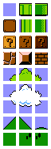

# img-tile
> tile an `` from a given width and height



```js
const tile = require("img-tile")
const load = require("img-load")

load("./tiles.png", (err, image) => {
  if (err) throw err
  let tiles = tile(image, 16, 16)
  for (let tile of tiles) {
    document.body.appendChild(tile)
  }
})
```

## usage
[![npm badge]][npm package]

### `tile(image, width, height) -> images`
Splits the given `image` into individual `<canvas>` elements of the dimensions described by `width` and `height`.

* `image`: The `HTMLImageElement` to be split
* `width`: The desired width of each resulting `<canvas>` element
* `height`: The desired height of each resulting `<canvas>` element

[npm package]: https://www.npmjs.org/package/img-tile
[npm badge]:   https://nodei.co/npm/img-tile.png?mini
